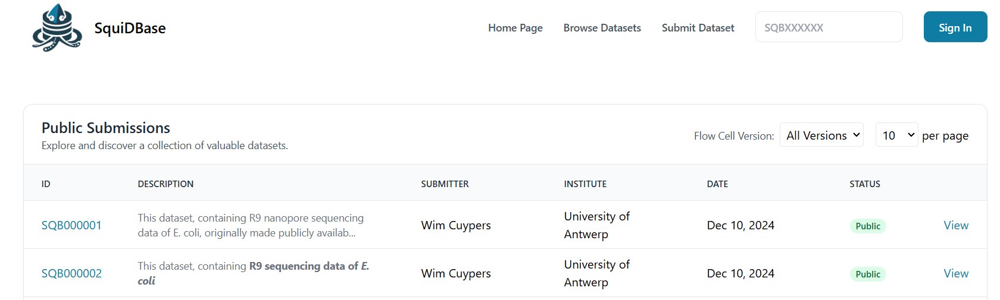
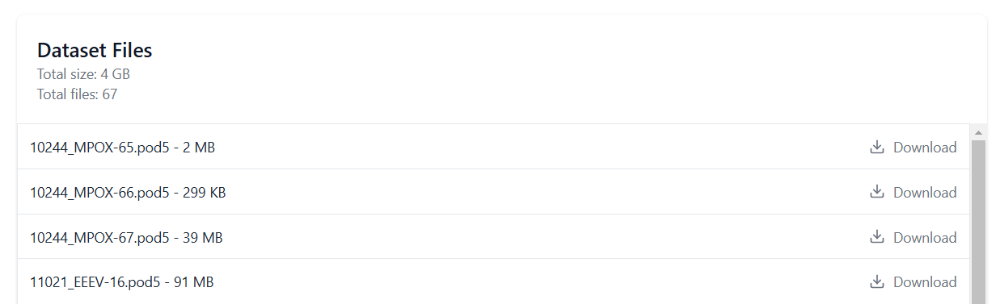

# Retrieving data from SquiDBase

On the [Browse Datasets](https://squidbase.org/submissions) page, you can explore all available datasets in SquiDBase. A useful feature is the 'Flow Cell Version' filter, which allows you to filter datasets based on the Nanopore chemistry used. For instance, if you're specifically interested in R10.4.1 data, simply select it from the filter, and only datasets that use this chemistry will be displayed.

/// caption
The 'Browse Datasets' page in SquiDBase.
///

## Manual download 

Once you have identified which datasets, each accompanied by a unique SquiDBase (SQB) identifier, you can click on the identifier and a page specific to this dataset will open. 

Each page, for example this entry [SQB000004](https://squidbase.org/submissions/SQB000004), will show an info field, a summary of the metadata, dataset sender details, and eventually the dataset files which are available for download. You can simply retrieve them by clicking the download button.

/// caption
Download section of a SquiDBase entry.
///

### About the data files

Note that all raw data in SquiDBase is currently in the POD5 format, also legacy R9 data which has been converted from FAST5 to POD5. Each data file consists reads that 

## Download links

Coming soon!
