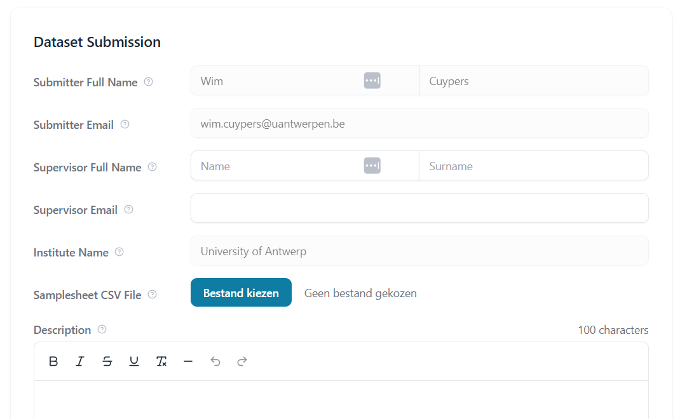
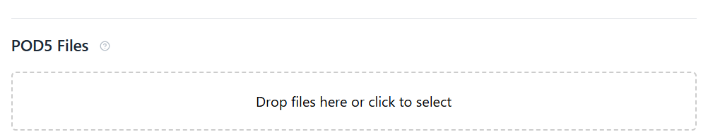

# Uploading data to SquiDBase

Before uploading data to SquiDBase, you need to create an account. This ensures that each dataset is linked to a submitter and a principal investigator (PI) or responsible person.  

You can sign up directly [here](https://squidbase.org/account/register) or visit the SquiDBase website, click **"Sign in"** in the top-right corner, and select **"Sign up here"**.

---

## Checklist before upload

Before proceeding with your upload, please ensure that your data meets the following requirements:

- The data must be of **microbial or viral origin** and **must not contain human data** to comply with privacy regulations. Metadata must also be free of patient-identifiable information.  
- Each upload should originate from **a single Nanopore sequencing chemistry**. This information is automatically extracted from your **POD5** files during upload.  
- Metadata should be as complete as possible. **Once uploaded, metadata cannot be modified**, except for the **info field**, which remains editable.  

Once your data meets these criteria, you have two options:
1. If each POD5 file contains only one biological species, you can proceed with the [upload process filtered data](#upload-when-data-is-already-filtered).  
2. Alternatively, if your dataset contains a mix of viral or microbial species, you can **filter out POD5 reads per species** using **SquiDPipe**, a dedicated pipeline designed for this purpose. These steps are explained under [upload process mixed data](#upload-of-mixed-datasets-–-running-squidpipe)

---

## Upload when data is already filtered

If your data has already been filtered (i.e., **each POD5 file contains reads from only one microbial or viral species**), you only need to upload:  

1. The **POD5 files**  
2. A **CSV file with the corresponding metadata**  

### Metadata CSV File Format
Each dataset uploaded to SquiDBase must be accompanied by a **metadata/samplesheet CSV file**. This file provides essential information about the samples and ensures proper indexing and retrieval.

General guidelines:

- The metadata file should be in **CSV format** (`.csv`).
- Missing values should be filled with **"NA"** (not left empty).
- Both **comma (`,`)** and **semicolon (`;`)** delimiters are accepted.
- Each row in the file represents **one POD5 file** and its corresponding metadata.
- Metadata **cannot be modified after upload**, except for the `remarks` field.

### Metadata Fields

The table below details the required fields in the metadata file, including their descriptions, expected data types, and example values.

| **Column Name**       | **Description**                                                                                                                                 |**Data Type**           | **Example Value**              |
|-----------------------|-------------------------------------------------------------------------------------------------------------------------------------------------|-------------------------|--------------------------------|
| `filename`           | The filename of the POD5 sequencing data to be uploaded.                                                                                         | String                  | `37124_CHIKV-1.pod5`          |
| `species_taxid`      | NCBI taxonomy identifier for the microbial species in the sample.                                                                               | NCBI taxonomy           | `37124`                        |
| `year_of_isolation`  | The year the pathogen or microbial/viral species was isolated.                                                                                                             | Integer                 | `2014`                         |
| `country_of_isolation` | The ISO 3166 country code indicating where the pathogen was isolated.                                                                        | ISO 3166 country code   | `BE`                |
| `geographic_origin`  | The geographic origin of the pathogen, if available. Can differ from `country_of_isolation` (e.g., in cases of imported infections).             | ISO 3166 country code   | `ET`           |
| `strain_lineage`     | The specific strain, lineage, or sequence type of the uploaded pathogen data.                                                                   | String                  | `BA.5`                         |
| `source_id`         | A unique identifier for the source of the pathogen sample, using the UBERON ontology.                                                           | UBERON ontology         | `UBERON:_0000178`              |
| `host_taxid`        | NCBI taxonomy identifier for the host species from which the pathogen was isolated, if applicable.                                             | NCBI taxonomy           | `9606`         |
| `internal_lab_id`    | Internal identification code assigned to the sample by the laboratory.                                                                          | String                  | `PLAS-ETH-2023-0147`           |
| `diagnostic_method_id` | The diagnostic method used to detect the pathogen, using the OBI ontology.                                                                 | OBI ontology            | `OBI:_0003045`                 |
| `remarks`           | Additional notes or remarks about the sample, often for internal collection records.                                                             | Text field              | `"Strain donated by institute X."` |

A **template CSV file** is available for download: [Download Template](assets/full.csv).  

#### Example Metadata Format  

| filename   | species_name    | species_taxid | year_of_isolation | country_of_isolation | geographic_origin | strain_lineage | source_id | host_taxid | internal_lab_id | diagnostic_method_id | remarks         |
|------------|---------------|--------------|-------------------|--------------------|----------------|--------------|----------|-----------|----------------|-------------------|----------------|
| file1.pod5  | DENV          | 11053        | 2014              | NA                 | NA             | ECSA         | NA       | NA        | NA             | NA                | ITM collection |
| file2.pod5  | HIV           | 11676        | 2015              | BE                 | NI             | ECSA         | NA       | NA        | NA             | NA                | ITM collection |
| file3.pod5  | ZIKV          | 64320        | 11053             | 2015               | BE             | ID           | NA       | NA        | NA             | NA                | NA             |
| file4.pod5  | SARS-CoV-2_A  | 2697049      | 11060             | 2018               | BE             | PE           | NA       | NA        | NA             | NA                | NA             |
| file5.pod5  | SARS-CoV-2_B  | 2697049      | 11060             | 2018               | BE             | PE           | NA       | NA        | NA             | NA                | NA             |

### Upload Interface in SquiDBase

After logging in to SquiDBase, you can access the [Submit page](https://squidbase.org/submissions/submit).  

On this page, you will need to:  
1. Fill in your **contact details**  
2. Provide a **short description** of your dataset  
3. Upload a **Samplesheet CSV file** containing metadata for your POD5 files  

  
/// caption
Dataset submission page in SquiDBase.
///

### Uploading POD5 Files  

Below the metadata submission section, you will find an area to upload your **POD5 files**, as shown in the image below.  

Once both the **CSV metadata file** and the **POD5 files** are uploaded, SquiDBase will perform basic validation checks, such as:  

- Ensuring that all **filenames in the CSV match** the uploaded POD5 files  
- Checking for potential formatting issues  

If no errors are detected, you can proceed by clicking the **Upload** button.  

/// caption
POD5 upload section.
///

### Making Your Data Public  

Once your data is uploaded, you will have the option to:  

- **Immediately make your dataset publicly available**  
- **Keep the dataset private** and enable the **"public" toggle** later when you are ready to share it (e.g., after your publication is under peer review)  

---

## Upload of mixed datasets – running SquiDPipe 

Many **Nanopore sequencing runs**, particularly those involving barcoded samples with multiple microbial or viral species, **contain mixed species per POD5 file**.  

To handle this, use **SquiDPipe**, a **Nextflow pipeline** designed to process barcoded runs, including **FASTQ files**. It will:  

- Classify reads based on the **basecalled sequences**  
- Automatically **separate POD5 files** by species
- Output a CSV for uploading to SquiDBase that matches the outputted POD5 filenames

For instructions on running **SquiDPipe**, visit:  
[**SquiDPipe GitHub Repository**](https://github.com/Cuypers-Wim/squidpipe)
